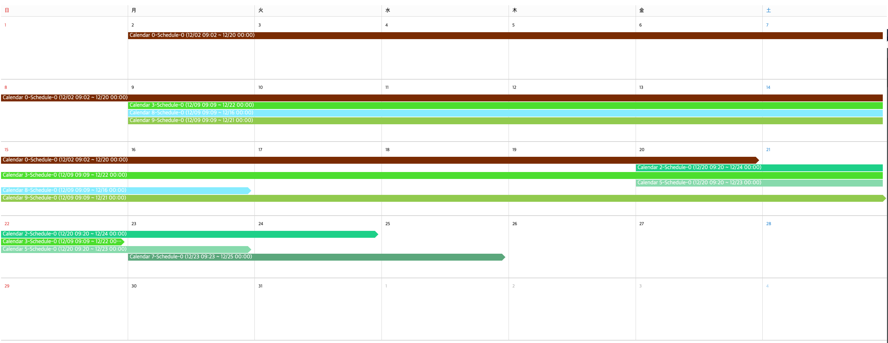
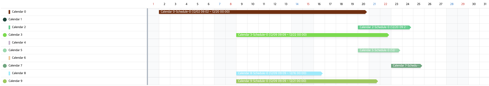

<!--
*** Thanks for checking out this README Template. If you have a suggestion that would
*** make this better please fork the repo and create a pull request or simple open
*** an issue with the tag "enhancement".
*** Thanks again! Now go create something AMAZING! :D
-->


<!-- PROJECT SHIELDS -->
<!--
*** I'm using markdown "reference style" links for readability.
*** Reference links are enclosed in brackets [ ] instead of parentheses ( ).
*** See the bottom of this document for the declaration of the reference variables
*** for build-url, contributors-url, etc. This is an optional, concise syntax you may use.
*** https://www.markdownguide.org/basic-syntax/#reference-style-links
-->
[](https://www.npmjs.com/package/osome-kit) 
[](https://standardjs.com)

<!-- PROJECT LOGO -->
<br />
<p align="center">
  <a href="https://github.com/madist/osome-kit">
    
  </a>

  <h3 align="center">Osome Kit</h3>

  <p align="center">
    An simple react calendar module. pure javascript. no jquery.
    <br />
    <a href="https://github.com/madist/osome-kit"><strong>Explore the docs »</strong></a>
    <br />
    <br />
    <a href="https://madist.github.io/osome-kit/">View Demo</a>
    ·
    <a href="https://github.com/madist/osome-kit/issues">Report Bug</a>
    ·
    <a href="https://github.com/madist/osome-kit/issues">Request Feature</a>
  </p>
</p>


<!-- TABLE OF CONTENTS -->
## Table of Contents

- [Table of Contents](#table-of-contents)
- [About The Project](#about-the-project)
- [Getting Started](#getting-started)
  - [Prerequisites](#prerequisites)
  - [Installation](#installation)
- [Usage](#usage)
  - [1. Before using `osome-kit` please import module.](#1-before-using-osome-kit-please-import-module)
  - [2. Implement below codes in the react render method.](#2-implement-below-codes-in-the-react-render-method)
    - [Calendar](#calendar)
    - [Gantt](#gantt)
  - [Supported Props](#supported-props)
    - [OSCalendar Props](#oscalendar-props)
    - [OSGantt Props](#osgantt-props)
      - [Options](#options)
- [Roadmap](#roadmap)
- [Contributing](#contributing)
- [License](#license)
- [Contact](#contact)


<!-- ABOUT THE PROJECT -->
## About The Project




This project support you can switching calendar & gantt easily.


<!-- GETTING STARTED -->
## Getting Started

This is an example of how you may give instructions on setting up your project locally.
To get a local copy up and running follow these simple example steps.

### Prerequisites

This is an example of how to list things you need to use the software and how to install them.
* npm
```sh
npm install npm@latest -g
```
* react
```sh
npm install --save react react-dom
```

### Installation

1. Npm install
   ```sh
   npm install --save osome-kit
   ```

<!-- USAGE EXAMPLES -->
## Usage
### 1. Before using `osome-kit` please import module.
```js
import { OSCalendar, OSGantt } from 'osome-kit'
```
### 2. Implement below codes in the react render method.
#### Calendar
```js
 <OSCalendar 
            options={this.state.options}
            categories={this.state.categories}
            onClickSchedule={this.onClickSchedule}
            onChangedSchedule={this.onChangedSchedule}
            onDragEndTile={(start, end, renderOption) => {
              const order = Math.round(Math.random() * 10) % (this.state.categories.length || 1)
              const category = this.state.categories[order]
              const index = category.events.length
              const data = (category === undefined) ? { title: 'This is Title', detail: 'This is Detail', style: { color: '#fff', backgroundColor: '#f00' }, index: index, order: order, startDate: start, endDate: end } : {
                title: category.content.title, detail: '', style: { color: '#fff', backgroundColor: category.content.style.color }, index: index, order: order, startDate: start, endDate: end
              }
              this.setState(update(this.state, { categories: { [order]: { events: { $push: [data] } } } }))
            }} />
```
#### Gantt
```js
<OSGantt style={{width: '100%', padding: '0'}} ref={this.osGantt} categories={this.state.categories} options={this.state.options}
          onChangedSchedule={this.onChangedSchedule}
          onChangedCategory={this.onChangedCategory}
          onClickSchedule={this.onClickSchedule}
          onDragEndTile={(row, start, end, renderOption) => {
            const category = this.state.categories[row]
            const data = { title: category.content.title, detail: 'This is Detail', style: { color: '#fff', backgroundColor: category.content.style.color }, order: row, startDate: start, endDate: end, index: category.events.length }
            this.setState(update(this.state, { categories: { [row]: { events: { $push: [data] } } } }))
          }}
        />
```
### Supported Props
#### OSCalendar Props
| Prop              | Description                                                                                |
| ----------------- | ------------------------------------------------------------------------------------------ |
| categories        | Event data                                                                                 |
| options           | Calendar's option                                                                          |
| onClickSchedule   | When click schedule block. it will be fired.                                               |
| onChangedSchedule | When Schedule changed user interaction. such as `move`,`resize` it will be fired.          |
| onClickMoreButton | When click more button. ( more button will be appeared when you set maxEvent in `options`) |

#### OSGantt Props
| Prop                      | Description                                                                                           |
| ------------------------- | ----------------------------------------------------------------------------------------------------- |
| categories                | Event data (same with above calnedar events)                                                          |
| options                   | Gantt's option                                                                                        |
| onClickSchedule           | When click schedule block. it will be fired.                                                          |
| onMouseRightClick         | When click mouse right button on left continaer's rows.                                               |
| onDragEndTile             | When mouse down and up in right container's row tiles it will be fired. (create schedule by dragging) |
| onChangedSchedule         | When schedule changed by user interaction. such as `move`,`resize` it will be fired.                  |
| onChangedCategory         | When category changed by user interaction. such as `move category` it will be fired.                  |
| onChangeContainer         | When container size changging. it will be fired every resized time.                                   |
| onCompleteContainerResize | When container's resize finished. it will be fired.                                                   |

##### Options
| Property  | Description |
| --------- | ----------- |
| type      |             |
| fixed     |             |
| disabled  |             |
| style     |             |
| country   |             |
| days      |             |
| today     |             |
| year      |             |
| month     |             |
| handleMin |             |
| handleMax |             |
___ 

<!-- ROADMAP -->
## Roadmap

See the [open issues](https://github.com/madist/osome-kit/issues) for a list of proposed features (and known issues).


<!-- CONTRIBUTING -->
## Contributing

Contributions are what make the open source community such an amazing place to be learn, inspire, and create. Any contributions you make are **greatly appreciated**.

1. Fork the Project
2. Create your Feature Branch (`git checkout -b feature/AmazingFeature`)
3. Commit your Changes (`git commit -m 'Add some AmazingFeature'`)
4. Push to the Branch (`git push origin feature/AmazingFeature`)
5. Open a Pull Request


<!-- LICENSE -->
## License

Distributed under the MIT License. See `LICENSE` for more information.


<!-- CONTACT -->
## Contact

GiPyeong Lee - [@gipyeong](https://linkedin.com/in/gipyeong-lee-85734396) - ocsoon.jin@gmail.com

Project Link: [https://github.com/madist/osome-kit](https://github.com/madist/osome-kit)